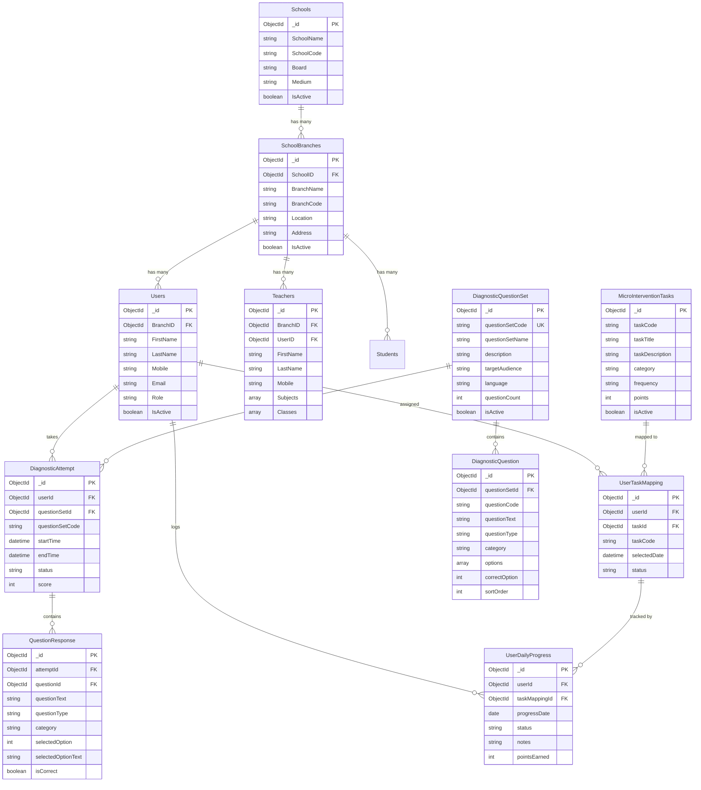
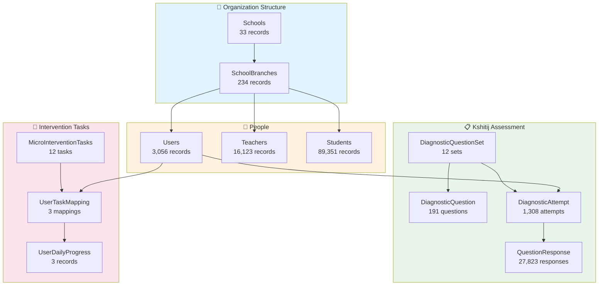
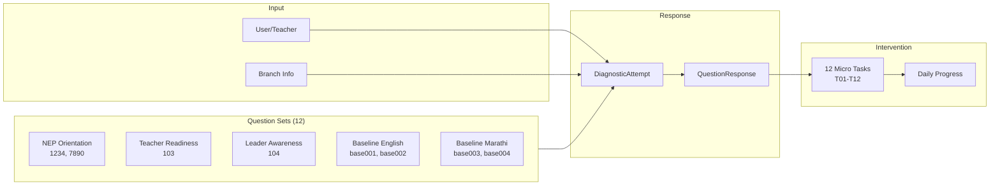

# Project Kshitij - Database ERD Documentation

## Overview
This document describes the Entity Relationship Diagram (ERD) for Project Kshitij (क्षितिज) - NEP-2020 Readiness Index system by Myelin.

---

## Complete ERD Diagram

---

## Simplified Flow Diagram

---

## Data Flow for NEP Readiness Assessment

---

## Collection Details

### Organization Structure

| Collection | Records | Description |
|------------|---------|-------------|
| Schools | 33 | Parent organization/school entities |
| SchoolBranches | 234 | Individual school branches/locations |

### People

| Collection | Records | Description |
|------------|---------|-------------|
| Users | 3,056 | All user accounts (teachers, leaders, admins) |
| Teachers | 16,123 | Teacher-specific records with subject mappings |
| Students | 89,351 | Student records |

### Kshitij Assessment

| Collection | Records | Description |
|------------|---------|-------------|
| DiagnosticQuestionSet | 12 | Question set definitions |
| DiagnosticQuestion | 191 | Individual questions |
| DiagnosticAttempt | 1,308 | User attempts on question sets |
| QuestionResponse | 27,823 | Individual question responses |

### Intervention Tasks

| Collection | Records | Description |
|------------|---------|-------------|
| MicroInterventionTasks | 12 | Intervention task definitions (T01-T12) |
| UserTaskMapping | 3 | User-task assignments |
| UserDailyProgress | 3 | Daily progress logs |

---

## Question Sets Summary

| Code | Question Set Name | Responses |
|------|-------------------|-----------|
| 1234 | NEP-2020 school teacher orientation | 2,671 |
| 7890 | NEP-2020 school leadership orientation | 391 |
| 101 | Leadership Demo Test | 36 |
| 102 | Leadership Demo Test Marathi | 25 |
| 103 | राष्ट्रीय शैक्षणिक धोरण (एन. ई. पी.) बाबत शिक्षकांची तयारी | 10,945 |
| 104 | शाळा प्रमुखांची राष्ट्रीय शैक्षणिक धोरण (एन. ई. पी.) बाबत सजगता | 1,349 |
| base001 | Teacher - NEP-2020 Readiness – Enablement & Systems Baseline | 4,716 |
| base002 | Leader - NEP-2020 Readiness – Enablement & Systems Baseline | 367 |
| base003 | Teacher - NEP-2020 Readiness – Enablement & Systems Baseline (Marathi) | 6,704 |
| base004 | Leader - NEP-2020 Readiness – Enablement & Systems Baseline (Marathi) | 617 |
| 1000 | Teacher lens-NEP enablement & support Readiness | 2 |

**Total Responses: 27,823**

---

## Collection Relationship Summary

| Parent Collection | Child Collection | Relationship | Join Field |
|-------------------|------------------|--------------|------------|
| Schools | SchoolBranches | 1:Many | SchoolID |
| SchoolBranches | Users | 1:Many | BranchID |
| SchoolBranches | Teachers | 1:Many | BranchID |
| SchoolBranches | Students | 1:Many | BranchID |
| Users | DiagnosticAttempt | 1:Many | userId |
| DiagnosticQuestionSet | DiagnosticQuestion | 1:Many | questionSetId |
| DiagnosticQuestionSet | DiagnosticAttempt | 1:Many | questionSetCode |
| DiagnosticAttempt | QuestionResponse | 1:Many | attemptId |
| MicroInterventionTasks | UserTaskMapping | 1:Many | taskId |
| Users | UserTaskMapping | 1:Many | userId |
| UserTaskMapping | UserDailyProgress | 1:Many | taskMappingId |

---

## Category-wise Response Summary

| Category | Sets | Total Responses |
|----------|------|-----------------|
| NEP Orientation | 1234, 7890 | 3,062 |
| Teacher Readiness (Marathi) | 103 | 10,945 |
| Leader Awareness (Marathi) | 104 | 1,349 |
| Enablement Baseline (English) | base001, base002 | 5,083 |
| Enablement Baseline (Marathi) | base003, base004 | 7,321 |
| Demo Tests | 101, 102 | 61 |
| Other | 1000 | 2 |

---

*Generated on: 2026-02-08*
*Project: Kshitij (क्षितिज) - NEP-2020 Readiness Index*
