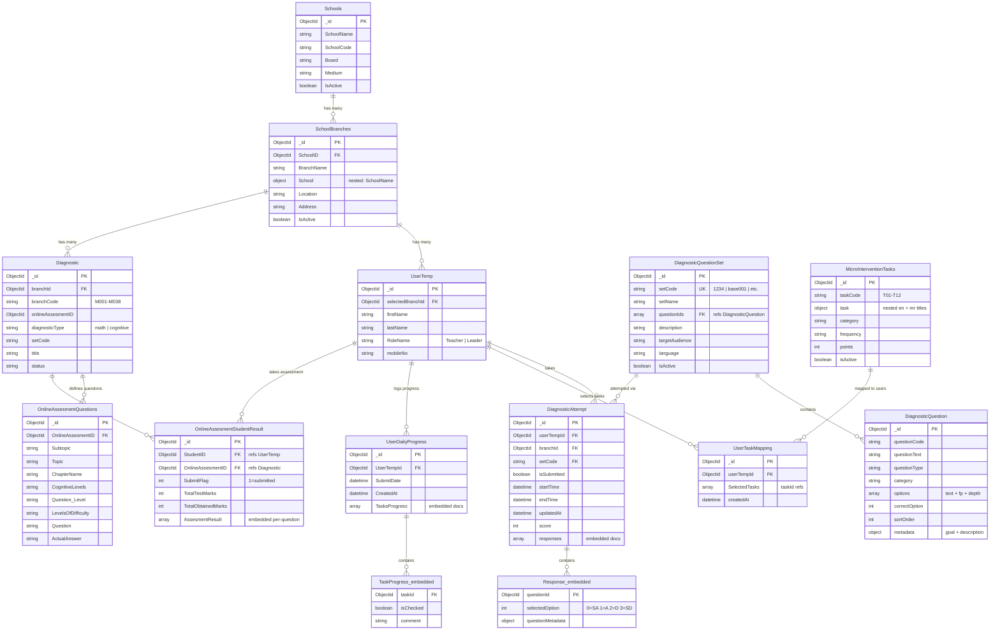
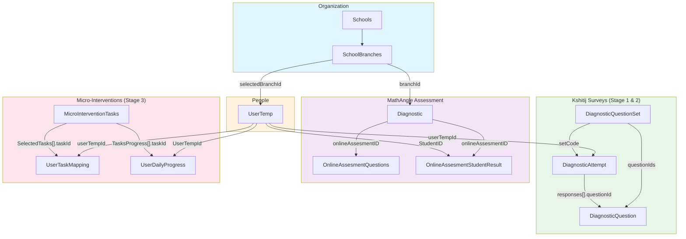

# Entity Relationship Diagram — Project Kshitij (क्षितिज)

> MongoDB database: `pdea_pilot` on prod server.
> Last verified: 2026-03-23.

---

## ER Diagram

---

## Collection Inventory

### Organization Structure

| Collection | ~Records | Description |
|---|---|---|
| **Schools** | 33 | Parent school organizations |
| **SchoolBranches** | 234 | Individual school branches/locations. **Note:** No `BranchCode` field — derive from `Diagnostic.branchCode` via `branchId` join |

### People

| Collection | ~Records | Description |
|---|---|---|
| **UserTemp** | 3,056 | All Kshitij users (teachers, leaders, admins). Fields: `firstName`, `lastName`, `RoleName`, `selectedBranchId` |
| Teachers | 16,123 | System-wide teacher records (not Kshitij-specific) |
| Students | 89,351 | System-wide student records (not Kshitij-specific) |

### Diagnostic Assessment (Kshitij Surveys)

| Collection | ~Records | Description |
|---|---|---|
| **DiagnosticQuestionSet** | 12 | Question set definitions. Key field: `setCode`. Uses `questionIds` array (not `questionSetId` on questions) |
| **DiagnosticQuestion** | 191 | Individual questions. Area mapping via `metadata.description` regex `/^[AB]\d/`. Options carry `fp` and `depth` levels |
| **DiagnosticAttempt** | 1,308 | User attempts. Responses are **embedded** as `responses[]` array with `questionId` + `selectedOption` (0=SA, 1=A, 2=D, 3=SD) |
| **Diagnostic** | varies | Instrument definitions. Critical for **branchCode ↔ branchId mapping** (M001–M038) and MathAngle `onlineAssesmentID` linkage |

### MathAngle / Online Assessment

| Collection | ~Records | Description |
|---|---|---|
| **OnlineAssesmentQuestions** | varies | MathAngle question metadata: `Topic`, `Subtopic`, `CognitiveLevels`, `LevelsOfDifficulty`. Linked via `OnlineAssesmentID` |
| **OnlineAssesmentStudentResult** | varies | Per-student results: `TotalTestMarks`, `TotalObtainedMarks`, `AssesmentResult[]` with per-question `ObtainedMarks`, `TimeTaken`, option sequences |

### Micro-Intervention Tasks

| Collection | ~Records | Description |
|---|---|---|
| **MicroInterventionTasks** | 12 | Task definitions T01–T12. Two ObjectId series: `697b1e2c…` and `697b1e3b…`. Bilingual titles in nested `task.en` / `task.mr` |
| **UserTaskMapping** | 100+ | User → task selections. `SelectedTasks` is an array of `{taskId}` objects. **Note:** 5 `userTempId` values don't exist in `UserTemp` (early test records) |
| **UserDailyProgress** | 1,000+ | Daily logs. `TasksProgress[]` contains `{taskId, isChecked, comment}`. Join to `UserTemp` via `UserTempId` (capital U) |

---

## Question Sets (setCodes)

| setCode | Stage | Audience | Language | ~Responses | Description |
|---|---|---|---|---|---|
| `1234` | 1 — Intent | Teacher | English | 2,671 | NEP-2020 school teacher orientation |
| `7890` | 1 — Intent | Leader | English | 391 | NEP-2020 school leadership orientation |
| `103` | 1 — Intent | Teacher | Marathi | 10,945 | शिक्षकांची तयारी (Teacher Readiness) |
| `104` | 1 — Intent | Leader | Marathi | 1,349 | शाळा प्रमुखांची सजगता (Leader Awareness) |
| `base001` | 2 — Baseline | Teacher | English | 4,716 | Enablement & Systems Baseline |
| `base002` | 2 — Baseline | Leader | English | 367 | Enablement & Systems Baseline |
| `base003` | 2 — Baseline | Teacher | Marathi | 6,704 | Enablement & Systems Baseline (Marathi) |
| `base004` | 2 — Baseline | Leader | Marathi | 617 | Enablement & Systems Baseline (Marathi) |
| `101` | dev | Leader | English | 36 | Leadership Demo Test |
| `102` | dev | Leader | Marathi | 25 | Leadership Demo Test Marathi |
| `1000` | dev | Teacher | English | 2 | Teacher lens-NEP enablement |

**Total: 27,823 responses across 11 question sets**

---

## Baseline Question Areas

### Teacher (19 Questions per set: base001 / base003)

| Area | Questions | Topic |
|---|---|---|
| A1 | 5 | Foundational Literacy & Numeracy |
| A2 | 5 | Holistic & Experiential Learning |
| A3 | 5 | Competency-Based Assessment |
| A4 | 4 | Continuous Professional Development |

Area derived from `metadata.description` regex: `/^A\d/`

### Leader (15 Questions per set: base002 / base004)

| Area | Questions | Topic |
|---|---|---|
| B1 | 3 | Vision & Leadership for NEP |
| B2 | 3 | Academic Planning & Monitoring |
| B3 | 3 | Teacher Development & Support |
| B4 | 3 | Community Engagement |
| B5 | 3 | Institutional Systems & Governance |

Area derived from `metadata.description` regex: `/^B\d/`

**Note:** Leader Marathi (base004) has different sub-topic wording than English (base002) but uses the same B1–B5 codes.

---

## Key Relationships

---

## Join Patterns Used in Scripts

| Join | Purpose | Scripts |
|---|---|---|
| `UserTemp._id` → `DiagnosticAttempt.userTempId` | Link user to survey responses | All extract scripts |
| `UserTemp.selectedBranchId` → `SchoolBranches._id` | Resolve user's school/branch | extract_all_constructs, extract_baseline_v2, micro_intervention_report |
| `DiagnosticQuestionSet.questionIds[]` → `DiagnosticQuestion._id` | Get questions for a set | extract_baseline_v2, extract_intent_readiness |
| `DiagnosticAttempt.responses[].questionId` → `DiagnosticQuestion._id` | Match response to question | extract_all_constructs, extract_baseline_v2, extract_intent_readiness |
| `Diagnostic.branchId` → `SchoolBranches._id` | Derive branchCode (M001–M038) from branchId | extract_all_constructs, extract_baseline_v2, gen_user_stage_matrix |
| `Diagnostic.onlineAssesmentID` → `OnlineAssesmentQuestions.OnlineAssesmentID` | Get MathAngle question metadata | extract_mathangle_jsonl |
| `Diagnostic.onlineAssesmentID` → `OnlineAssesmentStudentResult.OnlineAssesmentID` | Get MathAngle student results | extract_mathangle_jsonl |
| `OnlineAssesmentStudentResult.StudentID` → `UserTemp._id` | Link MathAngle results to user | extract_mathangle_jsonl |
| `UserTaskMapping.userTempId` → `UserTemp._id` | Link task selections to user | micro_intervention_report, extract_mapping_dates_v2 |
| `UserDailyProgress.UserTempId` → `UserTemp._id` | Link daily logs to user | extract_comments, extract_daily_progress_full |
| `UserDailyProgress.TasksProgress[].taskId` → `MicroInterventionTasks._id` | Resolve task names in logs | micro_intervention_report |

---

## Gotchas & Edge Cases

1. **SchoolBranches has NO `BranchCode`** — must derive via `Diagnostic` collection's `branchCode` field joined on `branchId`
2. **DiagnosticAttempt responses are embedded**, not a separate collection — `responses[]` is an array of subdocuments
3. **`selectedOption` encoding**: 0=Strongly Agree, 1=Agree, 2=Disagree, 3=Strongly Disagree
4. **UserDailyProgress uses capital `UserTempId`** while UserTaskMapping uses lowercase `userTempId`
5. **5 orphan records** in UserTaskMapping have `userTempId` values that don't exist in UserTemp (early test data)
6. **MicroInterventionTasks has two ObjectId series** (`697b1e2c…` and `697b1e3b…`) — both are valid
7. **`setName` not `title`** — DiagnosticQuestionSet uses `setName` for the display name
8. **`mongosh` outputs JS notation** — extraction scripts must use `JSON.stringify()` for valid JSON, not `printjson()`
9. **Dev/test setCodes** (`101`, `102`, `1000`) should be excluded from production dashboards

---

## Data Pipeline: Collection → Output Mapping

| Collections Used | Extract Script | Parse Script | Dashboard |
|---|---|---|---|
| UserTemp, DiagnosticAttempt, DiagnosticQuestion, DiagnosticQuestionSet, SchoolBranches, Diagnostic | extract_baseline_v2.js | — | 01 Baseline |
| UserTemp, UserTaskMapping, UserDailyProgress, MicroInterventionTasks, SchoolBranches | micro_intervention_report.js, extract_daily_progress_full.js | — | 02 Daily Progress |
| UserTemp, UserDailyProgress | extract_comments.js | — | 03 Comment Sentiment |
| UserTemp, UserTaskMapping, MicroInterventionTasks, SchoolBranches | micro_intervention_report.js, extract_mapping_dates_v2.js | — | 04 Task Mapping |
| UserTemp, DiagnosticAttempt, DiagnosticQuestion, DiagnosticQuestionSet, SchoolBranches, Diagnostic | extract_intent_readiness.js | parse_intent_readiness.py | 05 Intent Depth |
| UserTemp, DiagnosticAttempt, DiagnosticQuestion, DiagnosticQuestionSet, SchoolBranches, Diagnostic | extract_all_constructs.js | parse_all_constructs.py | 06 SRI |
| Diagnostic, OnlineAssesmentQuestions, OnlineAssesmentStudentResult, UserTemp, SchoolBranches | extract_mathangle_jsonl.js | parse_mathangle_jsonl.py | 07 MathAngle |

---

*Generated: 2026-03-23 | Database: pdea_pilot | Project: Kshitij (क्षितिज) — NEP-2020 Readiness Index*
